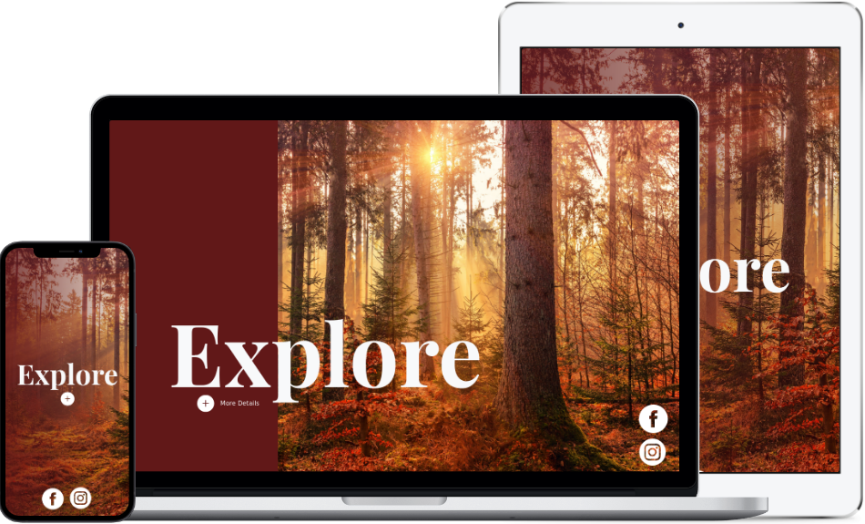

# Cozy Earth Coding Challenge

## Table of contents

- [Overview](#overview)
  - [Screenshot](#screenshot)
  - [Links](#links)
- [My process](#my-process)
  - [Built with](#built-with)
  - [What I learned](#what-i-learned)
  - [Continued development](#continued-development)
- [Author](#author)

## Overview

### Screenshot



### Links

- Solution URL: [Github Repo](https://github.com/jmcbutter/landing-page)
- Live Site URL: [Github Pages](https://jmcbutter.github.io/landing-page/dist/index.html)

## My process

### Built with

- Semantic HTML5 markup
- CSS custom properties
- Bootstrap 5
- SASS
- JavaScript

### What I learned

This was an opportunity for me to use bootstrap for the first time. While it did 
make the beginning of the development quicker, I found myself running into
issues with it later on, especially when dealing with media breakpoints. As most 
of the styling in Bootstrap is done via utility classes in HTML, I created a
JavaScript file to manage classes based on screen size. It wasn't until the
project was completed that I found more information within Bootstrap
documentation that may have made things much simpler.

Another interesting part of this project involved the animation of expanding the
"More Details" button into a full details card. I eventually settled on creating
an absolute-positioned `<div>` element and used `getBoundingRect()` to set
custom properties on the element that would be used to control the animation
starting and ending positions.

```js
function setCardAnimationAt(location, node) {
  // Set the position for the card animation to start or end at an existing node
  let borderRadius = node == moreButtonImg ? "100%" : 0;
  let { top, right, bottom, left, width, height } = getNodeProperties(node);
  animationCard.style.setProperty(`--${location}-top`, top + "px");
  animationCard.style.setProperty(`--${location}-bottom`, bottom + "px");
  animationCard.style.setProperty(`--${location}-left`, left + "px");
  animationCard.style.setProperty(`--${location}-right`, right + "px");
  animationCard.style.setProperty(`--${location}-width`, width + "px");
  animationCard.style.setProperty(`--${location}-height`, height + "px");
  animationCard.style.setProperty(`--${location}-border-radius`, borderRadius);
}

function getNodeProperties(node) {
  //Get the px values for the bounding rectangle
  if (Array.from(node.classList).includes('d-none')) {
    node.style.opacity = 0;
    node.classList.remove('d-none');
  }
  const { top, right, bottom, left } = node.getBoundingClientRect();
  const width = node.offsetWidth;
  const height = node.offsetHeight;
  return { top, right, bottom, left, width, height };
}
```

One other interesting thing I found was `image-set()`, a CSS property that helps 
to improve performance by serving different images based on pixel density

```css
  background: linear-gradient(90deg, rgba($primary, 0.8), rgba($primary, 0.1)),
              -webkit-image-set(
                  url(../img/Coding-Challenge-Image.png) 1x,
                  url(../img/Coding-Challenge-Image.png) 2x);;
```

## Author

- Website - [Jordan Butterfield](https://jmbutterfield.com)
- Github - [@jmcbutter](https://github.com/jmcbutter)
- Frontend Mentor - [@jmcbutter](https://www.frontendmentor.io/profile/jmcbutter)
- LinkedIn - [Jordan Butterfield](https://www.linkedin.com/in/jordan-butterfield-933274a9/)
